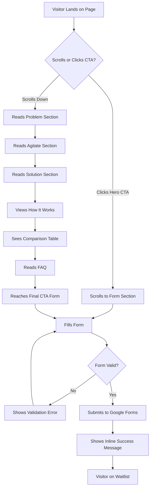

# LearnR Landing Page UI/UX Specification

This document defines the user experience goals, information architecture, user flows, and visual design specifications for the LearnR Landing Page. It serves as the foundation for frontend development, ensuring a cohesive and user-centered experience.

---

## 1. Introduction

### 1.1 Target User Persona

**The Time-Strapped Professional**

- Business analysts (and later PMs, finance professionals) with 5+ years experience
- Balancing demanding careers with certification prep
- Study in limited windows (evenings, weekends)
- Frustrated by inefficient tools
- Value their time above all
- Analytical, skeptical of marketing hype
- Respond to clear evidence of value

### 1.2 Usability Goals

| Goal                | Success Criteria                                            |
| ------------------- | ----------------------------------------------------------- |
| Instant clarity     | Visitor understands what LearnR does within 5 seconds       |
| Frictionless signup | Complete waitlist form in under 60 seconds                  |
| Mobile parity       | Full experience on phone (commuters checking during breaks) |
| Trust building      | Professional appearance matching product sophistication     |

### 1.3 Design Principles

1. **Clarity over cleverness** — Clear communication beats aesthetic innovation; busy professionals scan, not read
2. **Evidence over claims** — Show the comparison table, explain the algorithms; this audience respects substance
3. **Respect the scroll** — Each section earns its place; no padding, no fluff
4. **Calm confidence** — Softer tone, not aggressive; professional, not salesy
5. **Mobile-first thinking** — Design for the commuter checking their phone
6. **Icons, not emojis** — Use Lucide stroke icons exclusively; no emojis anywhere on the website

### 1.4 Change Log

| Date       | Version | Description           | Author            |
| ---------- | ------- | --------------------- | ----------------- |
| 2026-01-25 | 1.0     | Initial specification | Sally (UX Expert) |

---

## 2. Information Architecture

### 2.1 Page Structure

Single-page landing with linear scroll, designed for Phase 2 expansion to multi-page site.

```
┌─────────────────────────────────────┐
│  Header (Logo + Nav + CTA)          │
├─────────────────────────────────────┤
│  Hero Section                       │
│  - Headline + Subheadline           │
│  - Primary CTA                      │
│  - Trust indicators                 │
├─────────────────────────────────────┤
│  Problem Section                    │
│  - Pain point acknowledgment        │
├─────────────────────────────────────┤
│  Agitate Section                    │
│  - Hidden costs of inefficiency     │
├─────────────────────────────────────┤
│  Solution Section                   │
│  - Four algorithms explained        │
│  - Outcome-focused benefits         │
├─────────────────────────────────────┤
│  How It Works                       │
│  - 5-6 step visual walkthrough      │
├─────────────────────────────────────┤
│  Comparison Table                   │
│  - LearnR vs Traditional Apps       │
├─────────────────────────────────────┤
│  FAQ Section                        │
│  - Common objections addressed      │
├─────────────────────────────────────┤
│  Final CTA Section                  │
│  - Signup form (Name, Email, Exam)  │
│  - Inline success message           │
├─────────────────────────────────────┤
│  Footer                             │
│  - Privacy notice + Copyright       │
└─────────────────────────────────────┘
```

### 2.2 Navigation Structure

**Desktop Header:**

```
┌──────────────────────────────────────────────────────────────────────┐
│  [Logo]      Home   How It Works   Features   FAQ    [Get Early Access] │
└──────────────────────────────────────────────────────────────────────┘
```

**MVP Navigation (Anchor Links):**

| Nav Item     | MVP Target    | Phase 2 Target         |
| ------------ | ------------- | ---------------------- |
| Home         | #hero         | / (homepage)           |
| How It Works | #how-it-works | /how-it-works          |
| Features     | #solution     | /features              |
| FAQ          | #faq          | /faq                   |
| _Pricing_    | —             | /pricing _(add later)_ |
| _About_      | —             | /about _(add later)_   |
| _Blog_       | —             | /blog _(add later)_    |

**Mobile Navigation:**

- Hamburger icon (right side of header)
- Slide-out menu or dropdown
- Nav items + "Get Early Access" CTA button

**Header Behavior:**

- Sticky/fixed on scroll
- Background opacity/shadow increases on scroll
- CTA button always visible
- Smooth scroll to anchor sections

---

## 3. User Flows

### 3.1 Primary Flow: Waitlist Signup

**User Goal:** Join the LearnR early access waitlist

**Entry Points:**

- Direct URL (social media links from LinkedIn, Reddit, Facebook)
- Learning community referrals
- Shared links from colleagues



**Success Criteria:**

- Form submitted successfully
- User sees confirmation message
- Data captured in Google Sheets

### 3.2 Edge Cases & Error Handling

| Scenario              | Handling                                             |
| --------------------- | ---------------------------------------------------- |
| Empty required field  | Inline validation message below field                |
| Invalid email format  | "Please enter a valid email address"                 |
| Form submission fails | "Something went wrong. Please try again." + retry    |
| Slow connection       | Loading state on submit button ("Joining...")        |
| Duplicate submission  | Allow (Google Forms handles deduplication if needed) |
| JavaScript disabled   | Form still posts via standard HTML submission        |

---

## 4. Wireframes & Layout

**Build Tool:** Claude Code `/frontend-design` skill
**Animation Stack:** Lenis (smooth scroll) + GSAP + ScrollTrigger + SplitType
**Icons:** Lucide (stroke style)
**Layout Pattern:** Bento grids for organized, professional sections

---

### 4.1 Animation Stack Reference

| Purpose          | Library              | Implementation                        |
| ---------------- | -------------------- | ------------------------------------- |
| Smooth scroll    | Lenis                | Damped momentum, custom friction/lerp |
| Micro-animations | GSAP                 | Spring physics, timeline control      |
| Scroll triggers  | ScrollTrigger (GSAP) | Scrub, pin, parallax                  |
| Text splits      | SplitType            | Words/chars animate individually      |
| Counters         | GSAP                 | Synced with scroll position           |

**Animation Principles:**

- Spring/elastic easing (not stiff CSS)
- Staggered reveals with natural timing
- Subtle parallax depth (not excessive)
- Magnetic button hover effects
- Text reveal with mask/clip animations

---

### 4.2 Header

```
+-------------------------------------------------------------------------+
|  [Logo]                    Home  How It Works  Features  FAQ    [CTA]   |
+-------------------------------------------------------------------------+
```

| Property   | Specification                              |
| ---------- | ------------------------------------------ |
| Height     | 64-72px                                    |
| Behavior   | Sticky, backdrop blur + shadow on scroll   |
| Logo       | LearnR wordmark                            |
| Nav Links  | Smooth scroll to anchors (Lenis)           |
| CTA Button | Magnetic hover effect (GSAP), subtle scale |

---

### 4.3 Hero Section

```
+-------------------------------------------------------------------------+
|                                                                          |
|                                                                          |
|                    Stop Wasting Study Time                               |
|                    on What You Already Know                              |
|                                                                          |
|                    [Text reveal: words slide up                          |
|                     with mask, staggered timing]                         |
|                                                                          |
|                    LearnR maps your knowledge gaps and                   |
|                    calibrates to your skill level—delivering             |
|                    exactly what you need to learn, faster.               |
|                                                                          |
|                    [Subheadline fades in after headline]                 |
|                                                                          |
|                         [ Get Early Access ]                             |
|                         [Magnetic hover effect]                          |
|                                                                          |
|    +----------------------------------------------------------------+   |
|    |                                                                 |   |
|    |                      [HERO IMAGE - TOP 30%]                     |   |
|    |                                                                 |   |
|    |     Professional studying with abstract knowledge graph         |   |
|    |     overlay - top 30% visible above fold on page load           |   |
|    |                                                                 |   |
|    |     [Z-rotation: slight 3D tilt, ~2-3deg rotateX]               |   |
|    |     [Parallax: pronounced depth effect on scroll]               |   |
|    |                                                                 |   |
+------------------------------- FOLD ------------------------------------+
|    |                                                                 |   |
|    |                      [HERO IMAGE - BOTTOM 70%]                  |   |
|    |                                                                 |   |
|    |     Image continues below fold, revealing as user scrolls       |   |
|    |     Z-rotation flattens gradually on scroll (rotateX -> 0)      |   |
|    |     Parallax creates depth: image moves slower than scroll      |   |
|    |                                                                 |   |
|    +----------------------------------------------------------------+   |
|                                                                          |
|    ----------------------------------------------------------------------+
|    [Lucide: check]  50-75% fewer    [check] Complete    [check] Lasting  |
|                     questions               coverage            memory   |
|    [Staggered fade-up with 0.1s delay between items]                     |
|    [Trust bar appears BELOW hero image]                                  |
|                                                                          |
+-------------------------------------------------------------------------+
```

**Layout:**

1. Centered headline + subheadline + CTA
2. Hero image with top 30% visible above fold
3. Trust bar below hero image (revealed on scroll)

**Kinetic Typography (GSAP + SplitType):**

- Headline: SplitType by words, each word slides up with mask (stagger 0.08s)
- Subheadline: Fade + translateY after headline timeline completes
- CTA: Scale in with spring easing (0.3s delay)
- Trust bar: Staggered fade-up when scrolled into view (after hero image)

**Hero Image Animation (GSAP + ScrollTrigger):**

- **Initial State:** Top 30% visible, slight Z-rotation (rotateX: 3deg, perspective: 1000px)
- **On Scroll:**
  - Image reveals fully with parallax (moves at 0.7x scroll speed)
  - Z-rotation gradually flattens to 0deg (scrub animation)
  - Subtle scale effect (1.05 -> 1.0) adds depth
- **3D Effect:** CSS perspective on container, transform-style: preserve-3d
- **Visual Impact:** Creates premium, immersive feel that draws user into the page

**Hero Image Specs:**

- Content: Professional at laptop with subtle knowledge graph nodes overlaid (SVG)
- Aspect ratio: 16:9 or 3:2
- Width: Full container width (max-width constrained)
- Border-radius: 12-16px
- Shadow: Subtle drop shadow for depth

---

### 4.4 Problem Section

```
+-------------------------------------------------------------------------+
|                                                                          |
|    +---------------------------+    +--------------------------------+   |
|    |    [IMAGE]                |    |                                |   |
|    |                           |    |  Exam prep shouldn't feel      |   |
|    |    Professional looking   |    |  like guesswork.               |   |
|    |    at phone with mild     |    |  [Text reveal on scroll]       |   |
|    |    frustration            |    |                                |   |
|    |                           |    |  Body text paragraphs fade     |   |
|    |    [Parallax: subtle      |    |  in with stagger as user       |   |
|    |     vertical shift]       |    |  scrolls through section       |   |
|    |                           |    |                                |   |
|    +---------------------------+    +--------------------------------+   |
|                                                                          |
+-------------------------------------------------------------------------+
```

**Layout:** Two-column, image left, text right (reverses on mobile)

---

### 4.5 Agitate Section — Bento Grid with Animated Graph

```
+-------------------------------------------------------------------------+
|                                                                          |
|              The real cost of inefficient studying.                      |
|              [Text reveal: "real cost" emphasizes with highlight]        |
|                                                                          |
|    +-------------------------  BENTO GRID  -------------------------+    |
|    |                         |                                      |    |
|    |  +-------------------+  |  +--------------------------------+  |    |
|    |  | [Lucide: clock]   |  |  |                                |  |    |
|    |  | Wasted Time       |  |  |  FORGETTING CURVE GRAPH        |  |    |
|    |  | Every easy        |  |  |                                |  |    |
|    |  | question is time  |  |  |  100% |*                       |  |    |
|    |  | stolen from...    |  |  |       | \                      |  |    |
|    |  +-------------------+  |  |   75% |  \__                   |  |    |
|    |                         |  |       |     \__                |  |    |
|    |  +-------------------+  |  |   50% |        \__             |  |    |
|    |  | [Lucide: eye-off] |  |  |       |           \__          |  |    |
|    |  | Hidden Gaps       |  |  |   25% |              \___      |  |    |
|    |  | Your app tracks   |  |  |       |                  \___  |  |    |
|    |  | broad categories  |  |  |    0% +--------------------+   |  |    |
|    |  | but your exam...  |  |  |       Day1  Day7  Day14 Day30  |  |    |
|    |  +-------------------+  |  |                                |  |    |
|    |                         |  |  [GSAP: line draws on scroll,  |  |    |
|    |  +-------------------+  |  |   percentage counters animate] |  |    |
|    |  | [Lucide: trending-|  |  |                                |  |    |
|    |  |  down]            |  |  |  "Without reinforcement, you   |  |    |
|    |  | Forgetting Fast   |  |  |   forget 70% within a week."   |  |    |
|    |  | You studied last  |  |  |  [Fades in after line draws]   |  |    |
|    |  | Tuesday. Today... |  |  +--------------------------------+  |    |
|    |  +-------------------+  |                                      |    |
|    |                         |  +--------------------------------+  |    |
|    |  +-------------------+  |  | [Lucide: target]               |  |    |
|    |  | [Lucide: sliders] |  |  | Wrong Difficulty               |  |    |
|    |  | Guessing What     |  |  | Too easy teaches nothing.      |  |    |
|    |  | to Study          |  |  | Too hard frustrates.           |  |    |
|    |  | Is your textbook  |  |  +--------------------------------+  |    |
|    |  | the right...      |  |                                      |    |
|    |  +-------------------+  |                                      |    |
|    |                         |                                      |    |
|    +-------------------------+--------------------------------------+    |
|                                                                          |
+-------------------------------------------------------------------------+
```

**Bento Grid Layout:**

- Left column: 4 pain point cards (stacked)
- Right column: Large forgetting curve visualization + 1 additional card
- Cards fade-up with stagger on scroll

**Micro-interaction: Forgetting Curve**

- SVG line graph
- GSAP draws line path on scroll (stroke-dashoffset)
- Percentage markers count down as line progresses
- Supporting text fades in after animation

---

### 4.6 Solution Section — Four Algorithms Bento

```
+-------------------------------------------------------------------------+
|                                                                          |
|       What if your study app actually knew what you need?                |
|       [Text reveal: "actually knew" gets underline animation]            |
|                                                                          |
|    +-------------------------  BENTO GRID  -------------------------+    |
|    |                                                                 |    |
|    |  +---------------------------+  +---------------------------+   |    |
|    |  |                           |  |                           |   |    |
|    |  |  [ANIMATED SVG]           |  |  [ANIMATED SVG]           |   |    |
|    |  |  Network nodes connect    |  |  Chain: A -> B -> C       |   |    |
|    |  |                           |  |                           |   |    |
|    |  |  Bayesian Knowledge       |  |  Knowledge Graphs         |   |    |
|    |  |  Tracing                  |  |                           |   |    |
|    |  |                           |  |  Understands how          |   |    |
|    |  |  Maps every concept.      |  |  concepts connect.        |   |    |
|    |  |  Finds every gap.         |  |  Teaches prerequisites    |   |    |
|    |  |  No blind spots.          |  |  first.                   |   |    |
|    |  |                           |  |                           |   |    |
|    |  +---------------------------+  +---------------------------+   |    |
|    |                                                                 |    |
|    |  +---------------------------+  +---------------------------+   |    |
|    |  |                           |  |                           |   |    |
|    |  |  [ANIMATED SVG]           |  |  [ANIMATED SVG]           |   |    |
|    |  |  Slider finds sweet spot  |  |  Calendar dots appear     |   |    |
|    |  |                           |  |  at intervals             |   |    |
|    |  |  Item Response Theory     |  |  Spaced Repetition        |   |    |
|    |  |                           |  |                           |   |    |
|    |  |  Calibrates to your       |  |  Brings concepts back     |   |    |
|    |  |  exact level. Every       |  |  at the right time.       |   |    |
|    |  |  question maximizes       |  |  Builds lasting memory.   |   |    |
|    |  |  learning.                |  |                           |   |    |
|    |  |                           |  |                           |   |    |
|    |  +---------------------------+  +---------------------------+   |    |
|    |                                                                 |    |
|    +----------------------------------------------------------------+    |
|                                                                          |
+-------------------------------------------------------------------------+
```

**Bento Grid:** 2x2 equal cards

**Animated SVG Icons (GSAP on scroll):**

1. **BKT:** 6 nodes pulse, then lines connect them sequentially
2. **Knowledge Graphs:** Boxes labeled A, B, C link with arrows in sequence
3. **IRT:** Horizontal slider animates left-to-right, stops at "optimal" point
4. **Spaced Repetition:** Calendar grid, dots appear at day 1, 3, 7, 14, 30

**Text Animation:** Title slides in, description fades in with 0.2s delay

---

### 4.7 How It Works — Horizontal Steps with Progress Line

```
+-------------------------------------------------------------------------+
|                                                                          |
|                  Simple for you. Smart underneath.                       |
|                  [Text reveal: "Smart" gets underline]                   |
|                                                                          |
|    1 ========== 2 ========== 3 ========== 4 ========== 5                 |
|    [Progress line draws between nodes as user scrolls through section]   |
|                                                                          |
|  +----------+  +----------+  +----------+  +----------+  +----------+   |
|  |  [Icon]  |  |  [Icon]  |  |  [Icon]  |  |  [Icon]  |  |  [Icon]  |   |
|  | Lucide:  |  | Lucide:  |  | Lucide:  |  | Lucide:  |  | Lucide:  |   |
|  | file-    |  | pie-     |  | book-    |  | target   |  | check-   |   |
|  | question |  | chart    |  | open     |  |          |  | circle   |   |
|  +----------+  +----------+  +----------+  +----------+  +----------+   |
|  |  Quick   |  | See Your |  | Read     |  | Practice |  | Retain   |   |
|  |Diagnostic|  |   Gaps   |  |  What    |  |  Smart   |  | Forever  |   |
|  |          |  |          |  | Matters  |  |          |  |          |   |
|  |  15-25   |  |  Clear   |  |  Auto-   |  |  Right   |  |  Spaced  |   |
|  | questions|  | breakdown|  | matched  |  |  level   |  |  review  |   |
|  +----------+  +----------+  +----------+  +----------+  +----------+   |
|  [Cards scale up as progress line reaches them - GSAP scrub animation]   |
|                                                                          |
|    +----------------------------------------------------------------+   |
|    |     TEST-FOCUSED MICRO-LEARNING EFFICIENCY                      |   |
|    |                                                                 |   |
|    |     Traditional Apps                                           |   |
|    |     [======================================] 100 questions     |   |
|    |                                                                 |   |
|    |     LearnR                                                      |   |
|    |     [==========] 25 questions                                  |   |
|    |                                                                 |   |
|    |     [GSAP: bars animate width, counters count up]              |   |
|    |     [Traditional: slow fill to 100%]                           |   |
|    |     [LearnR: quick fill to 25%, highlighting efficiency]       |   |
|    +----------------------------------------------------------------+   |
|                                                                          |
+-------------------------------------------------------------------------+
```

**Progress Animation (ScrollTrigger scrub):**

- Line draws progressively as user scrolls
- Each step card scales from 0.9 to 1.0 as line reaches it
- Active step gets subtle highlight

**Micro-interaction: Efficiency Comparison**

- Two horizontal bars animate on scroll
- Numbers count up (GSAP counter)
- Visual contrast: LearnR bar in brand color, Traditional muted

---

### 4.8 Comparison Table — Animated Rows

```
+-------------------------------------------------------------------------+
|                                                                          |
|                Not all study apps are created equal.                     |
|                                                                          |
|    +--------------------+----------------+---------------------+         |
|    |                    | Traditional    |      LearnR        |         |
|    |                    |    Apps        | [Highlighted col]  |         |
|    +--------------------+----------------+---------------------+         |
|    | Test-focused       |    50-100      |    15-25           |         |
|    | micro-learning     |  questions     | [Lucide: check]    |         |
|    +--------------------+----------------+---------------------+         |
|    | Concept-level      | [Lucide: x]    | [Lucide: check]    |         |
|    | gap detection      |                |                    |         |
|    +--------------------+----------------+---------------------+         |
|    | Difficulty         |    Rarely      |    Always          |         |
|    | calibrated         |                | [Lucide: check]    |         |
|    +--------------------+----------------+---------------------+         |
|    | Reading content    |    Never       |    Automatic       |         |
|    | provided           |                | [Lucide: check]    |         |
|    +--------------------+----------------+---------------------+         |
|    | Retention system   |    None        |    Spaced Rep      |         |
|    |                    |                | [Lucide: check]    |         |
|    +--------------------+----------------+---------------------+         |
|    | Complete exam      |    Random      |    Every concept   |         |
|    | coverage           |    sampling    | [Lucide: check]    |         |
|    +--------------------+----------------+---------------------+         |
|                                                                          |
|    [Rows fade-up with stagger: 0.1s delay each]                          |
|    [Check icons draw with SVG stroke animation]                          |
|    [X icons use muted color]                                             |
|                                                                          |
+-------------------------------------------------------------------------+
```

**Animations:**

- Table rows stagger fade-up on scroll
- Checkmarks: SVG stroke-dashoffset draw effect
- LearnR column: subtle brand color background tint

---

### 4.9 FAQ Section — Smooth Accordion

```
+-------------------------------------------------------------------------+
|                                                                          |
|    [IMAGE: Abstract connected         Frequently Asked Questions         |
|     nodes illustration]               [Text reveal on scroll]            |
|    [Subtle floating animation]                                           |
|                                                                          |
|    +----------------------------------------------------------------+   |
|    | [Lucide: chevron-down]                                          |   |
|    | How is LearnR different from other adaptive learning apps?      |   |
|    +----------------------------------------------------------------+   |
|    | [Expanded content - smooth height transition]                   |   |
|    |                                                                 |   |
|    | Most adaptive apps do one thing—adjust difficulty OR track     |   |
|    | concepts. LearnR combines four algorithms...                    |   |
|    | [Content fades in after expand]                                 |   |
|    +----------------------------------------------------------------+   |
|    +----------------------------------------------------------------+   |
|    | [Lucide: chevron-right]                                         |   |
|    | How does LearnR know what reading content I need?               |   |
|    +----------------------------------------------------------------+   |
|    +----------------------------------------------------------------+   |
|    | [Lucide: chevron-right]                                         |   |
|    | Will LearnR cover everything on my exam?                        |   |
|    +----------------------------------------------------------------+   |
|    +----------------------------------------------------------------+   |
|    | [Lucide: chevron-right]                                         |   |
|    | How many questions does the initial assessment take?            |   |
|    +----------------------------------------------------------------+   |
|    +----------------------------------------------------------------+   |
|    | [Lucide: chevron-right]                                         |   |
|    | Which certification exams does LearnR support?                  |   |
|    +----------------------------------------------------------------+   |
|                                                                          |
+-------------------------------------------------------------------------+
```

**Accordion Animation (GSAP):**

- Smooth height transition with spring easing
- Chevron rotates 90deg on toggle
- Content fades in after container expands
- First item auto-expanded

**Image:** Abstract SVG illustration with nodes/connections, subtle floating animation (translateY oscillation)

---

### 4.10 Final CTA & Form — With Success State

```
+-------------------------------------------------------------------------+
|                                                                          |
|    [Subtle gradient background or pattern]                               |
|                                                                          |
|                   Ready to study smarter?                                |
|                   [Text reveal: "smarter" underline animation]           |
|                                                                          |
|              +-------------------------------------+                      |
|              |                                     |                      |
|              |  Name                               |                      |
|              |  +-------------------------------+  |                      |
|              |  | [Floating label on focus]     |  |                      |
|              |  +-------------------------------+  |                      |
|              |                                     |                      |
|              |  Email                              |                      |
|              |  +-------------------------------+  |                      |
|              |  | [Border highlight on focus]   |  |                      |
|              |  +-------------------------------+  |                      |
|              |                                     |                      |
|              |  Which exam are you preparing for?  |                      |
|              |  +-------------------------------+  |                      |
|              |  |  Select...                  v |  |                      |
|              |  +-------------------------------+  |                      |
|              |  Options: CBAP | PMP | CFA | Other  |                      |
|              |                                     |                      |
|              |      [ Get Early Access ]           |                      |
|              |      [Magnetic hover - GSAP]        |                      |
|              |      [Loading: spinner on submit]   |                      |
|              |                                     |                      |
|              |  [Lucide: lock] No spam. Unsubscribe anytime.             |
|              |                                     |                      |
|              +-------------------------------------+                      |
|                                                                          |
|    =====================================================================|
|                                                                          |
|              +-------------------------------------+                      |
|              |    SUCCESS STATE                    |                      |
|              |                                     |                      |
|              |         [Lucide: check-circle]      |                      |
|              |         [SVG draw animation]        |                      |
|              |                                     |                      |
|              |    You're on the list!              |                      |
|              |    [Text fades in]                  |                      |
|              |                                     |                      |
|              |    We'll notify you when LearnR    |                      |
|              |    is ready.                        |                      |
|              |                                     |                      |
|              +-------------------------------------+                      |
|                                                                          |
+-------------------------------------------------------------------------+
```

**Form Interactions:**

- Floating labels (GSAP translateY on focus)
- Input border transitions to brand color on focus
- Button: Magnetic hover effect (follows cursor slightly)
- Submit: Button text replaced with spinner, then checkmark

**Success Animation:**

- Form card crossfades to success state
- Large checkmark draws with SVG animation
- Success text fades in sequentially

---

### 4.11 Footer

```
+-------------------------------------------------------------------------+
|                                                                          |
|    [Logo]           (c) 2026 LearnR. All rights reserved.               |
|                     Privacy Policy                                       |
|                                                                          |
+-------------------------------------------------------------------------+
```

Minimal, no animations.

---

### 4.12 Image Strategy Summary

| Section      | Image Type                                 | Purpose                                      | Animation                                                                          |
| ------------ | ------------------------------------------ | -------------------------------------------- | ---------------------------------------------------------------------------------- |
| Hero         | Professional + knowledge graph SVG overlay | Draw user to scroll, convey "smart studying" | Top 30% above fold, Z-rotation (3deg), parallax depth, rotation flattens on scroll |
| Problem      | Relatable professional                     | Build empathy                                | Subtle parallax                                                                    |
| Agitate      | Forgetting curve graph (SVG)               | Data-driven pain point                       | Line draws on scroll                                                               |
| Solution     | Animated SVG icons (4x)                    | Explain algorithms visually                  | GSAP on scroll                                                                     |
| How It Works | Lucide icons + efficiency bar chart        | Show process + proof                         | Progress line scrub                                                                |
| FAQ          | Abstract nodes illustration                | Intellectual tone                            | Subtle float                                                                       |
| Final CTA    | Gradient/pattern background                | Focus without distraction                    | None                                                                               |

---

### 4.13 Kinetic Typography Summary (GSAP + SplitType)

| Element          | Animation                            | Trigger           |
| ---------------- | ------------------------------------ | ----------------- |
| Hero headline    | SplitType words, slide up with mask  | Page load         |
| Hero subheadline | Fade + translateY                    | After headline    |
| Hero CTA         | Scale in with spring                 | After subheadline |
| Trust bar items  | Staggered fade-up (below hero image) | ScrollTrigger     |
| Section headings | Text reveal with mask                | ScrollTrigger     |
| Key phrases      | Underline draws in                   | ScrollTrigger     |
| Algorithm titles | Slide in from left                   | ScrollTrigger     |
| Comparison rows  | Staggered fade-up                    | ScrollTrigger     |

---

### 4.14 Micro-interaction Summary

| Interaction               | Implementation                    | Purpose                                            |
| ------------------------- | --------------------------------- | -------------------------------------------------- |
| Forgetting Curve          | SVG path + GSAP stroke-dashoffset | Visualize memory decay                             |
| Micro-learning Efficiency | GSAP width animation + counter    | Show 4x fewer questions with test-focused approach |
| Algorithm Icons           | GSAP timeline on scroll           | Make technical concepts tangible                   |
| Checkmarks                | SVG stroke draw                   | Reinforce LearnR wins                              |
| Progress Line             | ScrollTrigger scrub               | Guide through process                              |
| Magnetic Buttons          | GSAP cursor tracking              | Premium interaction feel                           |
| Form Success              | GSAP crossfade + SVG draw         | Reward completion                                  |
| FAQ Accordion             | GSAP height + spring easing       | Polished expand/collapse                           |
| Smooth Scroll             | Lenis                             | Damped momentum feel                               |

---

## 5. Component Library

**Design System Approach:** Custom Tailwind-based components (no external UI library)

### 5.1 Buttons

| Variant   | Use Case                       | States                                                      |
| --------- | ------------------------------ | ----------------------------------------------------------- |
| Primary   | Main CTAs ("Get Early Access") | Default, Hover (magnetic + lift), Active, Loading, Disabled |
| Secondary | Nav links, minor actions       | Default, Hover, Active                                      |
| Ghost     | Text-only links in nav         | Default, Hover (underline draw)                             |

**Primary Button Specs:**

- Background: Brand primary color
- Padding: 16px 32px
- Border-radius: 8px
- Font-weight: 600
- Hover: Magnetic cursor effect (GSAP), translateY(-2px), shadow increase
- Loading: Text replaced with spinner, disabled state
- Transition: 200ms ease-out

### 5.2 Form Inputs

| Element          | Behavior                                                                    |
| ---------------- | --------------------------------------------------------------------------- |
| Text Input       | Floating label (GSAP translateY on focus), border color transition to brand |
| Select/Dropdown  | Custom styled, smooth height animation on open                              |
| Validation Error | Red border, inline error message fades in below field                       |
| Success          | Green border, Lucide check icon appears                                     |

**Input Specs:**

- Height: 48-56px
- Border: 1px solid neutral-300, 2px brand color on focus
- Border-radius: 6px
- Label: Transitions from placeholder position to above-input on focus

### 5.3 Cards (Bento Grid Items)

| Type            | Use                   | Contents                                         |
| --------------- | --------------------- | ------------------------------------------------ |
| Pain Point Card | Agitate section       | Lucide icon + title + description                |
| Algorithm Card  | Solution section      | Animated SVG + title + description               |
| Step Card       | How It Works          | Number badge + Lucide icon + title + description |
| Feature Card    | Comparison highlights | Icon + metric + label                            |

**Card Specs:**

- Background: White or subtle gray
- Border-radius: 12px
- Padding: 24px
- Border: 1px solid neutral-200 OR subtle shadow
- Hover: Optional translateY(-4px) + shadow increase

### 5.4 Accordion (FAQ)

| Element   | Specification                                       |
| --------- | --------------------------------------------------- |
| Trigger   | Full-width row, cursor pointer                      |
| Icon      | Lucide chevron-right, rotates 90deg to chevron-down |
| Animation | GSAP height transition, spring easing (300ms)       |
| Content   | Fades in after expand completes                     |

### 5.5 Table (Comparison)

| Element          | Specification                                    |
| ---------------- | ------------------------------------------------ |
| Container        | Rounded corners, subtle border                   |
| Header Row       | Sticky on mobile scroll, distinct background     |
| Data Rows        | Subtle alternating backgrounds or divider lines  |
| Highlight Column | Light brand color tint for LearnR                |
| Icons            | Lucide check (brand color), Lucide x (muted red) |
| Responsive       | Horizontal scroll on mobile with shadow hint     |

### 5.6 Trust Bar

- Layout: Horizontal flex, gap-8, centered
- Items: Lucide check icon (16px) + text
- Typography: Small/medium, medium weight

### 5.7 Progress Stepper (How It Works)

| Element | Specification                                    |
| ------- | ------------------------------------------------ |
| Line    | SVG path, stroke animates on scroll (GSAP scrub) |
| Nodes   | Circles with step numbers, fill on activation    |
| Cards   | Scale from 0.9 to 1.0 as line reaches them       |

### 5.8 Icons

- **Library:** Lucide (consistent stroke weight)
- **Sizes:** 16px (inline), 20px (buttons), 24px (UI), 32-48px (feature icons)
- **Color:** Inherit text color, or brand color for emphasis
- **Stroke Width:** 1.5-2px (default Lucide)

---

## 6. Branding & Style Guide

**Aesthetic Direction:** "Swiss Precision Meets Silicon Valley" — Clean geometric authority with humanist warmth. Premium fintech energy without coldness.

---

### 6.0 Color Analysis: learnr.ca Reference Site

**Colors Extracted from https://www.learnr.ca/ (VR Driving Training Product):**

| Color          | Hex       | Usage on learnr.ca                      |
| -------------- | --------- | --------------------------------------- |
| Dark Charcoal  | `#212529` | Primary buttons, dark backgrounds, text |
| Medium Blue    | `#266099` | Hover accent, interactive states        |
| Light Grey     | `#f8f9fa` | Button backgrounds, light text on dark  |
| Black          | `#000000` | Navbar background                       |
| Bootstrap Dark | `#212529` | Problem section dark panels             |
| White          | `#ffffff` | Section backgrounds, cards              |

**Typography on learnr.ca:** Questrial (Google Fonts) — a geometric sans-serif

---

#### Design Assessment: Are learnr.ca Colors Suitable for EdTech SaaS?

**Verdict: NOT RECOMMENDED for LearnR EdTech Product**

The learnr.ca color palette is designed for a VR driving/safety training product with a serious, tech-forward tone. For an EdTech SaaS targeting time-strapped professionals studying for certifications, these colors present several challenges:

| Issue                     | Analysis                                                                                                                                                                     |
| ------------------------- | ---------------------------------------------------------------------------------------------------------------------------------------------------------------------------- |
| **Too dark/cold**         | Heavy black/dark palette creates an ominous, serious tone. Learning environments benefit from warmer, more inviting colors that reduce study anxiety and promote engagement. |
| **Low differentiation**   | Black/white with blue accent is extremely generic — looks like every corporate SaaS. No distinctive brand personality that says "smart learning."                            |
| **Generic blue accent**   | `#266099` is standard corporate blue. Trustworthy but undifferentiated. Doesn't convey innovation or intelligence.                                                           |
| **Missing warmth**        | Learning products benefit from warm tones that create positive emotional associations with studying. The black/white palette feels transactional, not encouraging.           |
| **Poor for extended use** | Certification prep requires sustained attention over many sessions. High-contrast black/white is more fatiguing than softer neutrals.                                        |
| **No "progress" color**   | EdTech needs an accent color that celebrates achievements and progress. The muted blue doesn't create that "aha moment" feeling.                                             |

---

#### Why the Current Spec Colors Are Better for EdTech

| Current Spec Choice        | Why It Works for Learning                                                                                                              |
| -------------------------- | -------------------------------------------------------------------------------------------------------------------------------------- |
| **Deep Teal (`#0D7377`)**  | Combines trust (blue undertones) with freshness (green undertones). More distinctive than generic blue. Feels innovative yet reliable. |
| **Warm Neutrals**          | Create an inviting, calm study environment. Less stark than pure black/white. Easier on eyes during long study sessions.               |
| **Amber Gold (`#D97706`)** | Provides energy, highlights progress/achievements, creates positive emotional associations. Signals "smart" and "aha moments."         |
| **Warm Gray Scale**        | Better content hierarchy for educational material. Creates visual breathing room between dense certification content.                  |

---

#### Recommendation

**Keep the existing color palette defined in Section 6.1.** The current teal + amber + warm neutrals palette is specifically designed for EdTech user psychology and aligns with the target persona (analytical professionals who value substance and efficiency).

If brand alignment with learnr.ca is required in the future, consider:

- Using the dark charcoal (`#212529`) sparingly for footer or dark mode
- The medium blue (`#266099`) could inform a future secondary brand color
- Maintaining the warm neutrals and amber accent for the learning experience itself

---

### 6.1 Color Palette

**Primary — Deep Teal**

| Token       | Hex     | Usage                                 |
| ----------- | ------- | ------------------------------------- |
| primary-600 | #0D7377 | Primary CTAs, links, key highlights   |
| primary-700 | #0A5C5F | Hover states, emphasis                |
| primary-800 | #074547 | Active states, dark accents           |
| primary-100 | #E6F4F4 | Light backgrounds, LearnR column tint |

**Secondary — Warm Slate**

| Token         | Hex     | Usage                             |
| ------------- | ------- | --------------------------------- |
| secondary-600 | #64748B | Secondary text, icons, borders    |
| secondary-400 | #94A3B8 | Placeholder text, disabled states |
| secondary-800 | #1E293B | Dark headings, footer background  |

**Accent — Amber Gold**

| Token      | Hex     | Usage                                            |
| ---------- | ------- | ------------------------------------------------ |
| accent-500 | #D97706 | Highlights, progress indicators, "smart" moments |
| accent-400 | #FBBF24 | Hover glow, animated elements                    |

**Semantic Colors**

| Type    | Hex     | Usage                                   |
| ------- | ------- | --------------------------------------- |
| success | #059669 | Confirmations, checkmarks, form success |
| warning | #D97706 | Cautions (shares accent)                |
| error   | #DC2626 | Validation errors, X marks              |
| info    | #0D7377 | Informational (shares primary)          |

**Neutrals — Warm Gray Scale**

| Token       | Hex     | Usage                         |
| ----------- | ------- | ----------------------------- |
| neutral-50  | #FAFAF9 | Page background               |
| neutral-100 | #F5F5F4 | Card backgrounds, bento items |
| neutral-200 | #E7E5E4 | Borders, dividers             |
| neutral-300 | #D6D3D1 | Disabled borders              |
| neutral-500 | #78716C | Secondary body text           |
| neutral-700 | #44403C | Primary body text             |
| neutral-900 | #1C1917 | Headlines, bold text          |

---

### 6.2 Typography

**Font Stack**

| Role              | Font              | Fallback              | Purpose                                      |
| ----------------- | ----------------- | --------------------- | -------------------------------------------- |
| Display/Headlines | Cabinet Grotesk   | system-ui, sans-serif | Bold, confident, distinctive letterforms     |
| Body/UI           | Plus Jakarta Sans | system-ui, sans-serif | Refined, excellent readability, professional |
| Mono/Data         | JetBrains Mono    | monospace             | Algorithm names, technical terms, data       |

**Type Scale**

| Element          | Font              | Size    | Weight | Line Height | Letter Spacing |
| ---------------- | ----------------- | ------- | ------ | ----------- | -------------- |
| H1 (Hero)        | Cabinet Grotesk   | 56-72px | 700    | 1.0         | -0.03em        |
| H2 (Sections)    | Cabinet Grotesk   | 40-48px | 700    | 1.1         | -0.02em        |
| H3 (Cards)       | Cabinet Grotesk   | 24-28px | 600    | 1.25        | -0.01em        |
| H4 (Subsections) | Plus Jakarta Sans | 20px    | 600    | 1.4         | 0              |
| Body Large       | Plus Jakarta Sans | 18px    | 400    | 1.7         | 0              |
| Body             | Plus Jakarta Sans | 16px    | 400    | 1.6         | 0.01em         |
| Small/Caption    | Plus Jakarta Sans | 14px    | 500    | 1.5         | 0.01em         |
| Overline/Label   | Plus Jakarta Sans | 12px    | 700    | 1.4         | 0.08em         |
| Mono/Data        | JetBrains Mono    | 14-15px | 500    | 1.5         | 0              |

**Font Loading**

```html
<!-- Google Fonts (Plus Jakarta Sans) -->
<link rel="preconnect" href="https://fonts.googleapis.com" />
<link rel="preconnect" href="https://fonts.gstatic.com" crossorigin />
<link
  href="https://fonts.googleapis.com/css2?family=Plus+Jakarta+Sans:wght@400;500;600;700&display=swap"
  rel="stylesheet"
/>

<!-- Fontshare (Cabinet Grotesk) -->
<link
  href="https://api.fontshare.com/v2/css?f[]=cabinet-grotesk@400,500,600,700&display=swap"
  rel="stylesheet"
/>

<!-- JetBrains Mono -->
<link
  href="https://fonts.googleapis.com/css2?family=JetBrains+Mono:wght@400;500&display=swap"
  rel="stylesheet"
/>
```

---

### 6.3 CSS Variables

```css
:root {
  /* Colors - Primary */
  --color-primary-100: #e6f4f4;
  --color-primary-600: #0d7377;
  --color-primary-700: #0a5c5f;
  --color-primary-800: #074547;

  /* Colors - Secondary */
  --color-secondary-400: #94a3b8;
  --color-secondary-600: #64748b;
  --color-secondary-800: #1e293b;

  /* Colors - Accent */
  --color-accent-400: #fbbf24;
  --color-accent-500: #d97706;

  /* Colors - Semantic */
  --color-success: #059669;
  --color-warning: #d97706;
  --color-error: #dc2626;

  /* Colors - Neutrals */
  --color-neutral-50: #fafaf9;
  --color-neutral-100: #f5f5f4;
  --color-neutral-200: #e7e5e4;
  --color-neutral-300: #d6d3d1;
  --color-neutral-500: #78716c;
  --color-neutral-700: #44403c;
  --color-neutral-900: #1c1917;

  /* Typography */
  --font-display: "Cabinet Grotesk", system-ui, sans-serif;
  --font-body: "Plus Jakarta Sans", system-ui, sans-serif;
  --font-mono: "JetBrains Mono", monospace;

  /* Font Weights */
  --weight-regular: 400;
  --weight-medium: 500;
  --weight-semibold: 600;
  --weight-bold: 700;

  /* Type Scale */
  --text-xs: 0.75rem;
  --text-sm: 0.875rem;
  --text-base: 1rem;
  --text-lg: 1.125rem;
  --text-xl: 1.25rem;
  --text-2xl: 1.5rem;
  --text-3xl: 1.75rem;
  --text-4xl: 2.5rem;
  --text-5xl: 3rem;
  --text-6xl: 3.5rem;
  --text-7xl: 4.5rem;

  /* Spacing */
  --space-1: 0.25rem;
  --space-2: 0.5rem;
  --space-3: 0.75rem;
  --space-4: 1rem;
  --space-6: 1.5rem;
  --space-8: 2rem;
  --space-12: 3rem;
  --space-16: 4rem;
  --space-24: 6rem;

  /* Border Radius */
  --radius-sm: 4px;
  --radius-md: 8px;
  --radius-lg: 12px;
  --radius-xl: 16px;

  /* Shadows */
  --shadow-sm: 0 1px 2px rgba(0, 0, 0, 0.05);
  --shadow-md: 0 4px 6px rgba(0, 0, 0, 0.07);
  --shadow-lg: 0 10px 15px rgba(0, 0, 0, 0.1);
  --shadow-xl: 0 20px 25px rgba(0, 0, 0, 0.15);
}
```

---

### 6.4 Iconography

- **Library:** Lucide Icons
- **Style:** Stroke (not filled), consistent 1.5-2px stroke width
- **Sizes:** 16px (inline), 20px (buttons), 24px (UI), 32-48px (feature icons)
- **Color:** Inherit from text, or primary-600 for emphasis

---

### 6.5 Spacing & Layout

- **Grid:** 12-column on desktop, 4-column on mobile
- **Max Content Width:** 1280px
- **Section Padding:** 96px (desktop), 64px (tablet), 48px (mobile)
- **Card Gap:** 24px (desktop), 16px (mobile)
- **Base Unit:** 4px (all spacing multiples of 4)

---

## 7. Accessibility Requirements

**Compliance Target:** WCAG 2.1 Level AA

### 7.1 Visual Requirements

| Requirement                       | Specification                                |
| --------------------------------- | -------------------------------------------- |
| Color contrast (body text)        | Minimum 4.5:1 ratio                          |
| Color contrast (large text 24px+) | Minimum 3:1 ratio                            |
| Focus indicators                  | 2px solid primary-600 outline, 2px offset    |
| Text sizing                       | Base 16px, all sizes in rem for user scaling |
| Color independence                | Information not conveyed by color alone      |

### 7.2 Interaction Requirements

| Requirement         | Specification                                     |
| ------------------- | ------------------------------------------------- |
| Keyboard navigation | All interactive elements reachable via Tab        |
| Activation          | Enter/Space to activate buttons, links, accordion |
| Skip link           | Hidden skip-to-content link for keyboard users    |
| Touch targets       | Minimum 44x44px on mobile                         |
| Form errors         | Announced to screen readers, focus moved to error |

### 7.3 Content Requirements

| Requirement   | Specification                                                        |
| ------------- | -------------------------------------------------------------------- |
| Semantic HTML | Proper heading hierarchy (h1 > h2 > h3)                              |
| ARIA labels   | Applied to icons, interactive elements without visible text          |
| Alt text      | Descriptive alt for hero image, decorative images marked aria-hidden |
| Form labels   | All inputs have programmatically associated labels                   |
| Link text     | Descriptive (not "click here")                                       |

### 7.4 Motion & Animation

| Requirement      | Specification                                               |
| ---------------- | ----------------------------------------------------------- |
| Reduced motion   | Respect `prefers-reduced-motion: reduce`                    |
| Fallback         | Disable parallax, GSAP animations, auto-playing effects     |
| Essential motion | Keep functional transitions (accordion expand) but simplify |

```css
@media (prefers-reduced-motion: reduce) {
  *,
  *::before,
  *::after {
    animation-duration: 0.01ms !important;
    transition-duration: 0.01ms !important;
    scroll-behavior: auto !important;
  }
}
```

### 7.5 Testing Strategy

- Lighthouse accessibility audit (target score: 90+)
- Manual keyboard-only navigation test
- Screen reader testing (VoiceOver on Mac, NVDA on Windows)
- Color contrast verification via browser DevTools
- axe DevTools browser extension scan

---

## 8. Responsiveness Strategy

**Approach:** Mobile-first with Tailwind breakpoints

### 8.1 Breakpoints

| Name             | Min Width | Target Devices                     |
| ---------------- | --------- | ---------------------------------- |
| Mobile (default) | 0px       | Phones (portrait)                  |
| sm               | 640px     | Large phones (landscape)           |
| md               | 768px     | Tablets                            |
| lg               | 1024px    | Small laptops, tablets (landscape) |
| xl               | 1280px    | Desktops                           |
| 2xl              | 1536px    | Large screens                      |

### 8.2 Layout Adaptations

| Element              | Mobile               | Tablet (md)              | Desktop (lg+)              |
| -------------------- | -------------------- | ------------------------ | -------------------------- |
| **Header**           | Logo + hamburger     | Logo + hamburger         | Logo + full nav + CTA      |
| **Hero headline**    | 40-48px              | 48-56px                  | 56-72px                    |
| **Hero image**       | Full width, 30% peek | Full width, 30% peek     | Max-width 1280px           |
| **Bento grids**      | 1 column stack       | 2 columns                | 2-3 columns                |
| **How It Works**     | Vertical stack       | Horizontal scroll        | Horizontal + progress line |
| **Comparison table** | Horizontal scroll    | Full width               | Full width                 |
| **FAQ**              | Full width           | Max-width 768px centered | Max-width 768px centered   |
| **Form card**        | Full width - 32px    | Centered 480px           | Centered 480px             |
| **Section padding**  | 48px vertical        | 64px vertical            | 96px vertical              |

### 8.3 Navigation Behavior

**Mobile/Tablet (< 1024px):**

- Hamburger icon (Lucide: menu) right-aligned
- Tap opens slide-out menu from right
- Menu overlay with backdrop blur
- Nav items stack vertically
- CTA button at bottom of menu
- Close via X icon or backdrop tap

**Desktop (>= 1024px):**

- Full horizontal nav visible
- Smooth scroll to anchors
- CTA button in header

### 8.4 Touch Considerations

| Element     | Mobile Adaptation                              |
| ----------- | ---------------------------------------------- |
| Buttons     | Min height 48px, full-width on mobile          |
| Form inputs | Min height 48px, 16px font (prevents iOS zoom) |
| Accordion   | Full-width tap target                          |
| Table       | Horizontal scroll with shadow hints            |
| Cards       | Full width, increased padding                  |

### 8.5 Content Priority (Mobile)

1. Headline + CTA (immediate visibility above fold)
2. Hero image peek (30% visible, draws scroll)
3. Trust bar (on scroll)
4. Problem/Agitate (condensed copy)
5. Solution (stacked bento cards)
6. How It Works (vertical steps)
7. Comparison table (horizontal scroll)
8. FAQ (accordion, first open)
9. Form (sticky CTA option for mobile)

---

## 9. Animation & Micro-interactions

**Animation Stack:** Lenis + GSAP + ScrollTrigger + SplitType

### 9.1 Motion Principles

1. **Purposeful** — Every animation serves UX (guides attention, provides feedback)
2. **Subtle** — Premium feel, not distracting or playful
3. **Performant** — 60fps, GPU-accelerated transforms only
4. **Accessible** — Disabled for prefers-reduced-motion

### 9.2 Timing & Easing

| Type                 | Duration               | Easing                        |
| -------------------- | ---------------------- | ----------------------------- |
| Micro (hover, focus) | 150-200ms              | ease-out                      |
| UI transitions       | 250-350ms              | cubic-bezier(0.4, 0, 0.2, 1)  |
| Reveals (fade-up)    | 400-600ms              | cubic-bezier(0.16, 1, 0.3, 1) |
| Scroll-driven        | Scrub (tied to scroll) | Linear or ease-out            |
| Spring effects       | 500-800ms              | GSAP spring physics           |

### 9.3 Page Load Sequence (Hero)

```
0ms     ─── Page loads, Lenis initializes
100ms   ─── Hero headline words begin reveal (SplitType mask + stagger 0.08s)
600ms   ─── Subheadline fades in + translateY
800ms   ─── CTA button scales in with spring
1000ms  ─── Hero image visible (30% above fold, Z-rotation applied)
```

### 9.4 Scroll-Triggered Animations

| Element          | Trigger Point         | Animation                                     |
| ---------------- | --------------------- | --------------------------------------------- |
| Hero image       | On scroll             | Parallax (0.7x speed), Z-rotation 3deg → 0deg |
| Trust bar        | Enter viewport        | Staggered fade-up (0.1s delay each)           |
| Section headings | Enter 80% viewport    | Text reveal with mask                         |
| Bento cards      | Enter 80% viewport    | Staggered fade-up + scale 0.95 → 1            |
| Forgetting curve | Enter 60% viewport    | SVG line draws (1.5s), counters animate       |
| Algorithm icons  | Enter 70% viewport    | Custom SVG sequence per icon                  |
| Progress line    | Scrub through section | Stroke-dashoffset tied to scroll              |
| Step cards       | Progress line reaches | Scale 0.9 → 1, opacity 0.5 → 1                |
| Table rows       | Enter viewport        | Staggered fade-up (0.1s each)                 |
| Checkmarks       | Row visible           | SVG stroke draw (0.3s)                        |

### 9.5 Interaction Animations

| Element           | Trigger          | Animation                                   |
| ----------------- | ---------------- | ------------------------------------------- |
| Nav links         | Hover            | Underline draws left-to-right               |
| Primary button    | Hover            | Magnetic pull + translateY(-2px) + shadow   |
| Primary button    | Click            | Scale 0.98 feedback                         |
| Primary button    | Loading          | Text → spinner rotation                     |
| Form inputs       | Focus            | Border color transition, label floats up    |
| Accordion         | Click            | Height spring (300ms), chevron rotate 90deg |
| Accordion content | After expand     | Fade in (200ms delay)                       |
| Cards             | Hover (optional) | translateY(-4px) + shadow increase          |

### 9.6 Form Success Animation

```
0ms     ─── Form validates, submit button shows spinner
500ms   ─── Google Forms POST completes
600ms   ─── Button spinner → checkmark morph
800ms   ─── Form card crossfades to success state
1000ms  ─── Large checkmark SVG draws (0.5s)
1200ms  ─── "You're on the list!" fades in
1400ms  ─── Supporting text fades in
```

### 9.7 Lenis Configuration

```javascript
const lenis = new Lenis({
  duration: 1.2,
  easing: (t) => Math.min(1, 1.001 - Math.pow(2, -10 * t)),
  direction: "vertical",
  gestureDirection: "vertical",
  smooth: true,
  smoothTouch: false,
  touchMultiplier: 2,
});
```

### 9.8 GSAP Defaults

```javascript
gsap.defaults({
  ease: "power3.out",
  duration: 0.6,
});

// ScrollTrigger defaults
ScrollTrigger.defaults({
  toggleActions: "play none none none",
  start: "top 80%",
});
```

---

## 10. Performance Considerations

**Target:** Page load < 3 seconds, Lighthouse Performance 90+

### 10.1 Performance Goals

| Metric                         | Target |
| ------------------------------ | ------ |
| First Contentful Paint (FCP)   | < 1.5s |
| Largest Contentful Paint (LCP) | < 2.5s |
| Cumulative Layout Shift (CLS)  | < 0.1  |
| Time to Interactive (TTI)      | < 3.5s |
| Total Page Weight              | < 1MB  |

### 10.2 Icon Strategy: Lucide Icons

**IMPORTANT: Use Lucide stroke icons throughout — no emojis anywhere on the website.**

| Requirement    | Specification                                                |
| -------------- | ------------------------------------------------------------ |
| Icon library   | Lucide (https://lucide.dev)                                  |
| Style          | Stroke only (not filled)                                     |
| Stroke width   | 1.5-2px (consistent)                                         |
| Implementation | Inline SVG for animations, or Lucide package                 |
| Sizing         | 16px (inline), 20px (buttons), 24px (UI), 32-48px (features) |
| Color          | Inherit from parent text, or primary-600 for emphasis        |

**Common Icons Used:**

| Purpose                       | Lucide Icon                      |
| ----------------------------- | -------------------------------- |
| Checkmarks (trust bar, table) | `check`                          |
| X marks (comparison)          | `x`                              |
| Navigation menu               | `menu`                           |
| Close menu                    | `x`                              |
| Accordion expand              | `chevron-right` / `chevron-down` |
| Form success                  | `check-circle`                   |
| Lock (privacy)                | `lock`                           |
| Clock (time)                  | `clock`                          |
| Hidden gaps                   | `eye-off`                        |
| Trending down                 | `trending-down`                  |
| Target                        | `target`                         |
| Sliders                       | `sliders`                        |
| Steps: diagnostic             | `file-question`                  |
| Steps: gaps                   | `pie-chart`                      |
| Steps: reading                | `book-open`                      |
| Steps: practice               | `target`                         |
| Steps: retain                 | `check-circle`                   |

### 10.3 Optimization Strategies

| Area           | Strategy                                                    |
| -------------- | ----------------------------------------------------------- |
| **Images**     | WebP format, lazy loading below fold, srcset for responsive |
| **Fonts**      | Preconnect, font-display: swap, subset if possible          |
| **CSS**        | Tailwind purge unused styles, critical CSS inline           |
| **JavaScript** | Defer non-critical (GSAP, Lenis), code-split if needed      |
| **Animations** | GPU-accelerated transforms only (translate, scale, opacity) |
| **SVGs/Icons** | Inline Lucide SVGs for animated icons, tree-shake unused    |

### 10.4 Asset Budget

| Asset Type                         | Budget                                |
| ---------------------------------- | ------------------------------------- |
| HTML                               | < 50KB                                |
| CSS (Tailwind)                     | < 50KB (purged)                       |
| JavaScript (GSAP + Lenis + custom) | < 150KB                               |
| Fonts                              | < 150KB (3 families, limited weights) |
| Images                             | < 500KB total                         |
| Lucide icons (inline SVG)          | < 20KB                                |

### 10.5 Loading Strategy

```html
<!-- Critical: Fonts preconnect -->
<link rel="preconnect" href="https://fonts.googleapis.com" />
<link rel="preconnect" href="https://fonts.gstatic.com" crossorigin />
<link rel="preconnect" href="https://api.fontshare.com" />

<!-- Critical CSS inline in <head> -->
<style>
  /* Above-fold styles */
</style>

<!-- Fonts with swap -->
<link href="fonts..." rel="stylesheet" />

<!-- Deferred JS -->
<script src="lenis.min.js" defer></script>
<script src="gsap.min.js" defer></script>
<script src="ScrollTrigger.min.js" defer></script>
<script src="SplitType.min.js" defer></script>
<script src="main.js" defer></script>
```

---

## 11. Next Steps

### 11.1 Immediate Actions

1. Review and approve this UI/UX specification
2. Gather brand assets (logo files in SVG format)
3. Set up Google Form with fields (Name, Email, Targeted Exam) and obtain POST endpoint
4. Initialize project repository with folder structure
5. Configure Tailwind CSS with custom theme (colors, fonts, spacing from Section 6)
6. Install animation dependencies (Lenis, GSAP, ScrollTrigger, SplitType)
7. Begin build using Claude Code `/frontend-design` skill

### 11.2 Design Handoff Checklist

| Item                                           | Status   |
| ---------------------------------------------- | -------- |
| User persona defined                           | Complete |
| UX goals established                           | Complete |
| Design principles documented                   | Complete |
| Information architecture mapped                | Complete |
| User flows documented                          | Complete |
| Wireframes with imagery/animation specs        | Complete |
| Bento grid layouts specified                   | Complete |
| Component library defined                      | Complete |
| Color palette specified                        | Complete |
| Typography system specified (all sans-serif)   | Complete |
| Accessibility requirements (WCAG 2.1 AA)       | Complete |
| Responsive strategy (mobile-first)             | Complete |
| Animation specifications (GSAP/Lenis)          | Complete |
| Performance goals established                  | Complete |
| Icon strategy (Lucide stroke icons, no emojis) | Complete |

### 11.3 Open Items for Build

| Item                   | Action Required                                           |
| ---------------------- | --------------------------------------------------------- |
| Logo file              | Provide SVG format                                        |
| Hero image             | Source or generate professional + knowledge graph overlay |
| Algorithm SVG icons    | Create animated SVG assets for 4 algorithms               |
| Forgetting curve graph | Create SVG with animatable path                           |
| Final copy             | Merge Version A depth + Version B softer tone             |
| Google Form            | Create form, get POST endpoint URL                        |

### 11.4 Build Inputs

**Reference Documents:**

- This specification: `docs/front-end-spec.md`
- Project brief: `docs/brief.md`
- Copy (comprehensive): `website/landing-page-copy.md`
- Copy (softer tone): `website/landing-page-copy-alt-b.md`
- Animation reference: `website/site animations.md`

**Build Tool:** Claude Code with `/frontend-design` skill

**Technology Stack:**

- Static HTML + Vanilla JavaScript
- Tailwind CSS
- Lenis (smooth scroll)
- GSAP + ScrollTrigger (animations)
- SplitType (text animations)
- Lucide Icons (inline SVG)
- Google Forms (form backend)

---

## Document Complete

**Specification:** LearnR Landing Page UI/UX
**Version:** 1.0
**Date:** 2026-01-26
**Author:** Sally (UX Expert)
**Status:** Ready for Development
